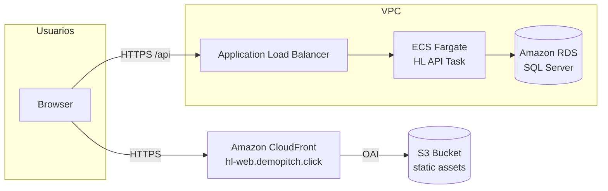
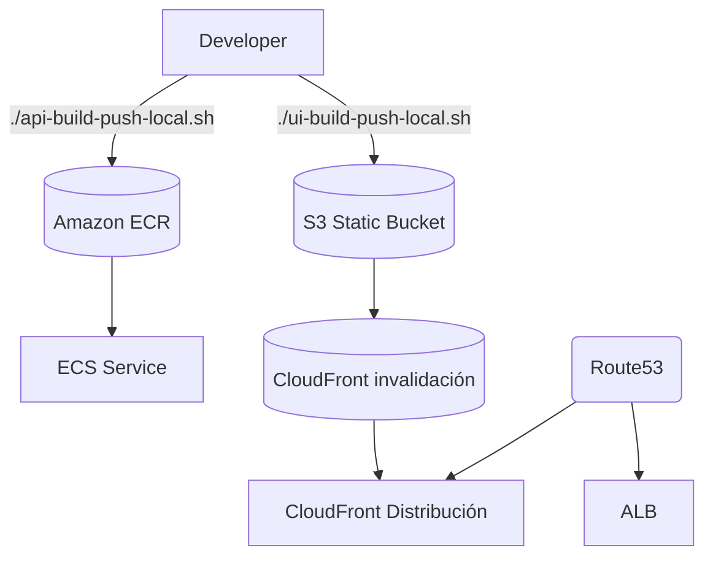

# HL Deals Platform

HL Deals es una plataforma integral para originar, estructurar y gestionar operaciones de inversión. El stack combina un backend ASP.NET Core desplegado en AWS ECS Fargate, una SPA Angular servida vía CloudFront y un pipeline de infraestructura automatizado con Terraform.

- **Frontend (SPA)**: https://hl-web.demopitch.click
- **API REST**: https://hl-api.demopitch.click

## Arquitectura





## Componentes principales

| Capa | Servicio | Descripción |
|------|----------|-------------|
| Frontend | Angular 17, Angular Material | SPA responsive con autenticación JWT y dashboards de deals |
| API | ASP.NET Core 8 | Endpoints REST (Deals, Auth) con EF Core y SQL Server |
| Infraestructura | AWS | VPC, ECS Fargate, ALB, RDS SQL Server, S3 + CloudFront, Route53 |
| IaC | Terraform | Provisión de red, RDS, ECS, ECR, S3, CloudFront, Route53 |
| DevOps | Bash scripts | `api-build-push-local.sh` y `ui-build-push-local.sh` automatizan build y despliegue |

## Backend (hl-api)

- **Framework**: ASP.NET Core 8 + Entity Framework Core
- **Autenticación**: JWT Bearer Tokens
- **Base de datos**: Microsoft SQL Server en Amazon RDS
- **Entorno**: Docker multi-stage → ECR → ECS Fargate (subredes privadas)
- **CORS**: Configurado en `appsettings.*` para clientes autorizados
- **Healthcheck**: `/healthz`

### Endpoints principales

| Método | Ruta | Descripción |
|--------|------|-------------|
| POST | `/api/auth/login` | Devuelve JWT (usuarios demo: admin/alice/bob/guest) |
| GET | `/api/deals` | Lista deals |
| POST | `/api/deals` | Crea deal |
| PUT | `/api/deals/{id}` | Actualiza deal |
| DELETE | `/api/deals/{id}` | Elimina deal |

### Build & Deploy API

```bash
# Compila, construye imagen y actualiza la task definition en ECS
./api-build-push-local.sh \
  REGION=us-east-1 \
  REPO=hl-api \
  CLUSTER=hl-ecs-cluster \
  SERVICE=hl-api-service
```

El script realiza:
1. `dotnet restore` + `dotnet publish -r linux-x64`
2. Build docker (`Dockerfile.runtime`) y push a ECR
3. Actualiza la Task Definition y el servicio ECS

## Frontend (hl-web)

- **Framework**: Angular 17 / Angular Material (landing y página About en `/about` con resumen arquitectónico)
- **Branding**: assets en `public/brand/` (`favicon`, logos horizontal/mark)
- **Deploy**: build local → sync a S3 → invalidación en CloudFront
- **URL**: https://hl-web.demopitch.click (Route53 alias → CloudFront)

### Build & Deploy Frontend

```bash
./ui-build-push-local.sh \
  REGION=us-east-1 \
  ENVIRONMENT=dev \
  CLOUDFRONT_DISTRIBUTION_ID=E123456789ABC
```

Pasos internos:
1. `npm ci` + `npm run build --configuration production`
2. `aws s3 sync` → sube assets estáticos (excepto `index.html`)
3. `aws s3 cp` → actualiza `index.html` sin caché agresiva
4. `aws cloudfront create-invalidation --paths '/*'`

Si no se especifica `CLOUDFRONT_DISTRIBUTION_ID`, el script intenta inferirlo por comentario (`hl-deals-web-<env>`).

## Infraestructura (terraform/hl-infra)

### Recursos clave

- **Red**: VPC / subredes públicas y privadas, NAT Gateway
- **Base de datos**: `aws_db_instance` via módulo `terraform-aws-modules/rds/aws`
- **ECS**: Cluster + task definition (Fargate) + Security Groups
- **ALB**: Listeners HTTP→HTTPS, target group con healthcheck `/healthz`
- **Certificados**: ACM us-east-1 (`arn:aws:acm:us-east-1:144776104140:certificate/942d4d56-7c76-4681-a8b5-7a6813ff987c`)
- **Route53**: Registros `hl-api.demopitch.click` (ALB) y `hl-web.demopitch.click` (CloudFront)
- **S3 + CloudFront**: bucket privado con OAI, distribución con `index.html` como default root object

### Ejecución

```bash
cd terraform/hl-infra
terraform init
terraform plan
terraform apply
```

Outputs relevantes (`terraform output`):
- `api_https_endpoint`
- `cloudfront_domain_name`
- `frontend_https_endpoint`
- `cloudfront_distribution_id`

## Estructura del repositorio

```
firstDemo/
├── hl-api/                         # API ASP.NET Core
│   ├── Controllers/, Models/, Dtos/
│   ├── appsettings.*.json
│   ├── Dockerfile, Dockerfile.runtime
│   └── publish/ (build artefacts)
├── hl-web/                         # Angular SPA
│   ├── src/ (componentes, themes)
│   ├── public/brand/ (logos, favicons)
│   └── manifests, angular.json
├── terraform/hl-infra/             # Terraform IaC
│   ├── main.tf, variables.tf
│   ├── outputs.tf, terraform.tfvars
│   └── state files
├── scripts raíz
│   ├── api-build-push-local.sh
│   ├── ui-build-push-local.sh
│   └── otros auxiliares (.sh)
└── tests/, postman/, README.md
```

## Desarrollo local

### Requisitos
- Docker Desktop
- .NET 8 SDK
- Node.js 20 / npm 10+
- AWS CLI v2 configurado (`aws configure`)

### Pasos rápidos

```bash
# Backend local
cd hl-api
dotnet restore
ASPNETCORE_ENVIRONMENT=Development dotnet run

# Frontend local
cd hl-web
npm install
npm start
```

La SPA espera la API en `http://localhost:8080/api` (ver `environment.ts`). Ajusta CORS en `appsettings.Local.json` si cambias origen.

## Seguridad y buenas prácticas

- **JWT Secrets**: No commitear secretos reales. En producción usar AWS Secrets Manager / SSM Parameter Store.
- **HTTPS**: Forzado por ALB (HTTP→301→HTTPS) y CloudFront.
- **Bucket Privado**: Acceso solo vía CloudFront OAI.
- **Roles demo**: admin (admin), alice/bob (user), guest (viewer). Ajustar en `AuthController`/`USERS` según políticas reales.

## Referencias adicionales

- [Terraform AWS Modules](https://github.com/terraform-aws-modules)
- [ASP.NET Core Deployment to ECS](https://learn.microsoft.com/aspnet/core/host-and-deploy)
- [Angular Deployment to S3 + CloudFront](https://docs.aws.amazon.com/AmazonCloudFront/latest/DeveloperGuide/Introduction.html)

---

¿Dudas o mejoras? Abre un issue o contacta al equipo de plataforma de HL Deals.
