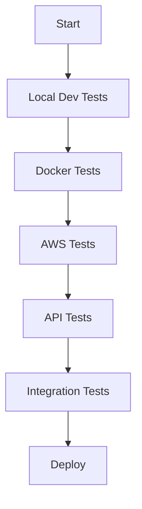

# HL-API Test Suite

This directory contains comprehensive test scripts for the HL-API project. The test suite covers everything from AWS connectivity to full workflow integration.

## Test Suite Overview

```
tests/
├── README.md                          # This documentation
├── run-all-tests.sh                   # Master test runner script
├── aws-services/
│   └── test-aws-connectivity.sh       # AWS CLI and services validation
├── docker/
│   └── test-docker-build.sh           # Docker image build and container tests
├── api/
│   └── test-api-endpoints.sh          # API endpoints and authentication tests
├── local-dev/
│   └── test-local-setup.sh            # Local development environment tests
└── integration/
    └── test-full-workflow.sh          # Complete workflow integration tests
```

## Quick Start

### Run All Tests
To run the complete test suite:
```bash
./tests/run-all-tests.sh
```

### Run Individual Tests
Run specific test categories:
```bash
# AWS Connectivity and Services
./tests/aws-services/test-aws-connectivity.sh

# Docker Build and Functionality
./tests/docker/test-docker-build.sh

# API Endpoints and Authentication
./tests/api/test-api-endpoints.sh

# Local Development Setup
./tests/local-dev/test-local-setup.sh

# Full Workflow Integration
./tests/integration/test-full-workflow.sh
```

## Test Categories

### 1. AWS Services Tests (`aws-services/`)

#### test-aws-connectivity.sh
- ✅ **Purpose**: Validates AWS CLI configuration and service accessibility
- 🎯 **What it tests**:
  - AWS CLI credentials and profile setup
  - Basic connectivity to AWS services
  - ECR repository access (hl-api)
  - ECS cluster access (hl-ecs-cluster)
  - ALB configuration
  - RDS instance access
  - CloudWatch Logs access
  - IAM permissions validation
- 💡 **Usage**: Run before any AWS deployment activities
- 🚨 **Prerequisites**: AWS CLI configured with appropriate profile

---

### 2. Docker Tests (`docker/`)

#### test-docker-build.sh
- ✅ **Purpose**: Validates Docker image build process and container functionality
- 🎯 **What it tests**:
  - Docker installation and compatibility
  - Dockerfile validity and multi-stage build process
  - Image creation with unique timestamp
  - Container startup and health checks
  - API endpoints availability in container
  - Swagger documentation access
  - Container logs and environment variables
  - Automatic cleanup of test resources
- 💡 **Usage**: Run before pushing to ECR or deploying to production
- 🚨 **Prerequisites**: Docker installed and running

---

### 3. API Tests (`api/`)

#### test-api-endpoints.sh
- ✅ **Purpose**: Comprehensive API endpoint testing with authentication
- 🎯 **What it tests**:
  - Health check endpoint (/healthz)
  - JWT authentication flow (/api/auth/login)
  - Full CRUD operations for deals:
    - GET /api/deals (list all deals)
    - POST /api/deals (create deal)
    - GET /api/deals/{id} (get specific deal)
    - PUT /api/deals/{id} (update deal)
    - DELETE /api/deals/{id} (delete deal)
  - Authentication/authorization validation
  - HTTP status codes and error handling
- 💡 **Usage**: Requires running API instance (either local or Docker)
- 🚨 **Prerequisites**: API server running (see configuration section)

---

### 4. Local Development Tests (`local-dev/`)

#### test-local-setup.sh
- ✅ **Purpose**: Validates local development environment and project structure
- 🎯 **What it tests**:
  - .NET SDK installation and version
  - Project structure integrity (Controllers, Models, Services)
  - Package restoration (dotnet restore)
  - Project build process (dotnet build)
  - Configuration files (appsettings.json, CORS, Swagger)
  - JWT setup and database connections
  - Solution file integration
  - Git integration (.gitignore)
- 💡 **Usage**: Run to validate local development setup
- 🚨 **Prerequisites**: .NET 8.0 SDK installed

---

### 5. Integration Tests (`integration/`)

#### test-full-workflow.sh
- ✅ **Purpose**: End-to-end workflow testing from development to deployment
- 🎯 **What it tests**:
  - Phase 1: Local development workflow
  - Phase 2: Docker integration
  - Phase 3: API integration in Docker container
  - Phase 4: AWS integration (ECR, ECS, etc.)
  - Phase 5: Deployment script validation
  - Phase 6: Cleanup and resource management
- 💡 **Usage**: Complete integration testing with real Docker container
- 🚨 **Prerequisites**: See individual test requirements

---

## Test Configuration

### API Endpoints Configuration

You may need to modify the API base URL in test scripts:

```bash
# For local development testing
API_BASE_URL="http://localhost:5001"  # Default .NET dev server

# For Docker container testing
API_BASE_URL="http://localhost:8090"  # Docker container

# For AWS deployed testing
API_BASE_URL="https://your-alb-endpoint.amazonaws.com"  # ALB DNS name
```

### AWS Profile Configuration

Tests use the default AWS profile. If you need to use a different profile:

```bash
# Set environment variable for specific profile
export AWS_PROFILE=juanops

# Or configure default profile to point to desired profile
aws configure set default.profile juanops
```

---

## Test Runner Features

### Automated Test Execution
The `run-all-tests.sh` script provides:
- ✅ **Sequential execution** of all test suites
- ✅ **Color-coded output** with clear status indicators
- ✅ **Test result tracking** (passed/failed counts)
- ✅ **Automatic script validation** and permission setting
- ✅ **Test report generation** with timestamps
- ✅ **Exit codes** for CI/CD integration
- ✅ **Next steps guidance** based on results

### Test Results Interpretation

```
✅ PASSED - Test completed successfully
⚠️  WARNING - Test passed but with recommendations
❌ ERROR - Test failed, requires immediate attention
🚨 FATAL - Test failed and prevented further execution
```

### Test Reports
- Test results saved to timestamped log files
- Format: `test-results-YYYYMMDD-HHMMSS.log`
- Location: `./tests/` directory
- Includes full execution summary and timestamps

---

## Development Workflow

### Recommended Testing Sequence



1. **Local Development Tests** → Validate development environment
2. **Docker Tests** → Ensure containerization works
3. **AWS Tests** → Verify cloud infrastructure access
4. **API Tests** → Test application functionality
5. **Integration Tests** → Validate complete workflow
6. **Deploy** → Proceed with confident deployment

### CI/CD Integration

For continuous integration:

```bash
# In your GitHub Actions, Jenkins, or similar CI/CD pipeline
./tests/run-all-tests.sh
exit_code=$?

if [ $exit_code -eq 0 ]; then
    echo "All tests passed! Proceeding with deployment..."
    # Deploy to next environment
else
    echo "Tests failed! Stopping deployment pipeline."
    exit 1
fi
```

---

## Troubleshooting

### Common Issues

#### Test Fails with Permission Denied
```bash
# Make all test scripts executable
find tests/ -name "*.sh" -exec chmod +x {} \;
```

#### AWS CLI Not Configured
```bash
# Configure AWS CLI
aws configure --profile juanops

# Verify configuration
aws sts get-caller-identity --profile juanops
```

#### Docker Not Running
```bash
# Start Docker service
sudo systemctl start docker  # Linux
# Or open Docker Desktop on Mac/Windows
```

#### .NET SDK Not Found
```bash
# Install .NET 8.0 SDK
# Linux: https://docs.microsoft.com/en-us/dotnet/core/install/linux
# macOS: https://docs.microsoft.com/en-us/dotnet/core/install/macos
# Windows: https://docs.microsoft.com/en-us/dotnet/core/install/windows
```

#### API Server Not Running
```bash
# Start API locally for testing
cd hl-api && dotnet run

# Or start in Docker for container testing
docker run -d -p 8090:8080 hl-api:latest
```

### Test Dependencies

- **AWS CLI**: For cloud service tests
- **Docker**: For containerization tests
- **curl**: For API endpoint testing
- **jq**: For JSON parsing in API tests (optional)
- **.NET 8.0 SDK**: For local development tests

### Environment Variables

Some tests use environment variables:
- `AWS_PROFILE`: Specify AWS profile to use
- `API_BASE_URL`: Override default API endpoint for testing

---

## Contributing to Tests

### Adding New Tests

1. Create test script in appropriate subdirectory
2. Add proper shebang and error handling
3. Include clear status messages and color output
4. Document test purpose and prerequisites
5. Update `run-all-tests.sh` to include new test
6. Update this README documentation

### Test Script Template

```bash
#!/bin/bash

echo "🔧 HL-API: [Test Name]"
echo "=========================="

# Colors and functions
# [include standard color definitions and print functions]

# Test logic here
# [implement test functionality]

echo ""
echo "=========================="
print_success "[Test Name] Completed!"
```

---

## Advanced Usage

### Running Tests in Parallel
```bash
# Run AWS and Docker tests simultaneously
./tests/aws-services/test-aws-connectivity.sh &
./tests/docker/test-docker-build.sh &
wait
```

### Automated Test Scheduling
```bash
# Add to crontab for regular testing
0 */4 * * * cd /path/to/hl-api && ./tests/run-all-tests.sh
```

### Test Environment Setup
```bash
# Create test-specific environment
export HL_API_TEST_MODE=true
export HL_API_TEST_DATABASE=test-db.sqlite
```

---

## Support

For test-related issues:
1. Run individual tests to isolate problems
2. Check test output for specific error messages
3. Ensure all prerequisites are installed
4. Verify configuration files are properly set up
5. Review AWS permissions and access rights

**Last Updated**: September 2025
**Test Suite Version**: 1.0.0
**Framework**: Bash/Shell Scripts
